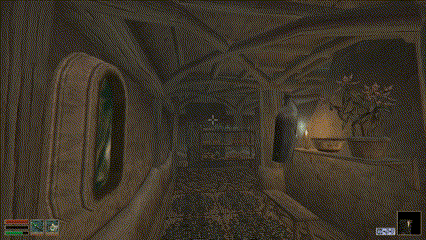
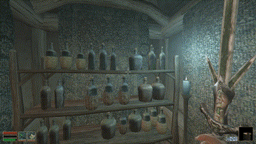

[Watch Video Demo Here](https://youtu.be/5klixjQGopU)

## Lua Physics for OpenMW

A deranged mod that implements a somewhat simple and naive physics engine in pure lua and exposes a rich interface for developers.

Think Half-Life 1 level of physics, maybe a bit better.

Apart from being mostly developer-centered API - this mod also enables physics all of the items in the game (things you can put in you inventory). You can drag them around, throw them and break bottles. But be warned - messing around with someone's property too much - will not be tolerated (if noticed, which depends on your sneak skill, proximity and sheer luck)

### Credits

Sound Effects: Sound effects were recorded, scavenged from freesound.org or otherwise produced by [NimSound](https://nimsound.ru/) and myself. Additionally a sound library "Lesser Vibes" by Sergey Eybog was used.

Separate thanks to [taitechnic](https://next.nexusmods.com/profile/taitechnic/mods) for exposing a series of convenient interface functions from OpenMW Impact Effects and helping with visual effects.

### Installation

---

Install dependencies:
[OpenMW Impact Effects](https://www.nexusmods.com/morrowind/mods/55508)
Highly recommended, but probably not required.

---
Use Mod Organiser 2 - if you downloaded mod archive manually (e.g from Git) - drag-n-drop it into the Mod Organiser 2

Or, if you want to install manually:

Extract contents into your Data Files

---

Enable LuaPhysicsEngine.omwscripts in the Launcher

---

### How to use

Set up a key bind for dragging items around in settings->scripts->LuaPhysics. Drag items around by holding that key. While dragging - press attack key to throw. Hitting items with a weapon or fists will send them flying or even break some of them (some bottles).

Ranged attacks or spells currently DO NOT AFFECT physics objects, since there no OpenMW api exposed yet to manage those. Actors moving through stationary physics objects also will not affect them.

### Developer API

Apart from playing around with physics items - primary purpose of this mod is to expose a set of methods that other developers can use to implement physics-based mods.

Every item in a game is physics-enabeld by default. 

Local script of that object exposes the LuaPhysics interface

```Lua
local I = require('openmw.interfaces')
local physObject = I.LuaPhysics.physicsObject
```

`physObject` is a representation of a physics object which drives this gameObject. Through this instance you have access to all the physics object properties and functions. See `PhysicsObject.lua` for a full list. Most likely you would want to use the following methods:

```Lua
physObject:applyImpulse(impulse, culprit)
-- Applies a vec3 impulse to an object instantly altering it's velocity. Culprit is a gameobject (NPC) responsible for this impulse application - culprit is used by the crime detections system. If necessary - it's probably safe to set it to nil.
physObject:updateProperties(properties)
-- properties is a table of properties mathing property keys found on an instance of physObject (see physicsObject:new() in PhysicsObject.lua for a list of possible properties). It's HIGHLY recommended to use this method to update object's physical properties, instead of setting them directly on an instance. Properties you might be interested in are:
weight: number, -- Initially weights is determined automatically, but can be overriden using this property
bounce: number -- 0 - 1: how bouncy is this object?
--
-- Some properties of the physObject that you might want to read:
physObject.velocity  -- vec3 currently velocity of the physics object
physObject.isSleeping -- if true - object is in a sleep state, its not being simulated, unless acted upon by a player or hit by another object, every object starts in a sleeping state
```

Same methods can be triggered by sending an openmw event to a gameObject on which `PhysicsEngineLocal.lua` is running, such as:
```Lua
object:sendEvent("LuaPhysics_ApplyImpulse",{
    impulse = impulse,
    culprit = culprit
})
-- To trigger an applyImpulse method on an object (if such an object is a physics object)
-- See eventHandlers of PhysicsEngineLocal.lua for a full list of events. As a general rule all events are names "LuaPhysics_EventName" 
```

If you want to remove a physicsObject from the world - it's paramount to use a special global event for that, instead of gameObject:remove() :
```Lua
core.sendGlobalEvent("LuaPhysics_RemoveObject",{
    object = gameObject
})
```

This will ensure that correct cleanup procedures are executed.

Additionally you might want to catch collision events.
_Every_ object, even non-physics ones - will receive collision events through the openmw event system. The regular way of catching such events applies:
```Lua
eventHandlers = {
    LuaPhysics_CollidingWithPhysObj = function(eData)
        eData.other -- This is a serialised data of a physics object which triggered the collision, it's a read-only data, no changes to this data will affect the original physics object
    end
}
```

More importantly a set of custom event exposed on a `I.LuaPhysics.physicsObject`, note that those are _NOT_ a part of an OpenMW event system. They are only accessible from a local script throug the exposed inteface:

```Lua
local physObject = I.LuaPhysics.physicsObject

local function onCollision(collisionData)
    -- Following fields are available on collisionData
    collisionData.hitPos
    collisionData.hitObject
    collisionData.hitNormal
    collisionData.hitPhysObject --If collided with another physics object - this will be a serialised data of that other physics object, again - changing this serialised data will not affect another physics object in any way
end

physObject.onCollision:addEventHandler(onCollision)
physObject.onPhysObjectCollision:addEventHandler(onCollision)
     
```

You might also want to attach a handler to `physObject.onIntersection` - this event supposed to trigger in cases when physicsObject passes through another object without triggering a collision, such as an object spawned inside a collider of another object and passing through from withing onto the outside. That was the intent, but to my knowledge this event is never triggered and from-within passing through a collider is not even possible.

If you want to physics-enable other object types (e.g a Container type) - assign `PhysicsEngineLocal.lua` to that type via your `.omwscripts` mod file. Note that default config of the physics object works only with collider-less game objects (those objects don't have a grid around them when tcb console command is active). It is possible to use `PhysicsEngineLocal.lua` with collider objects, but that support is experimental and is slower than the default. To enable it - in a local script of such object set `physObject.collisionMode = "aabb" (default is "sphere")`.

Destructible objects are also supported given one provides appropriate destroyed object chunk meshes - I currently don't feel like describing that system, so if you are interested in using it - look at `PhysicsDestructibleGlobal.lua` and `meshes\debris` folder. In short - if theres a collection of debri meshes matching specifi object's mesh name - then this object will be destructible. `I.LuaPhysicsDestructibles.onPreFracture` event emitter can be used to get notified and to control destructibility of specific objects (e.g to prevent an object from being destroying, even though it has debri meshes).

This is hopefully enough info to implement practically anything. Its totally possible that I've made a crytical typo here or there or forgot to mention something. In that case I can only suggest looking into the source files.


